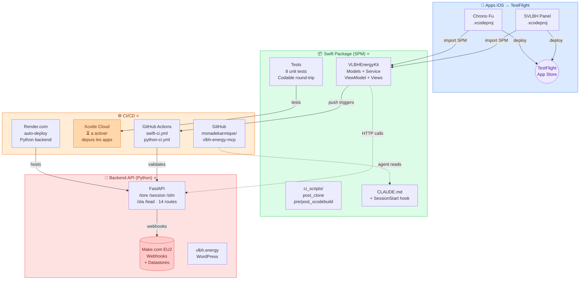

# Ecosysteme VLBH Energy — Architecture & CI/CD

> Digital Shaman Lab — monadekarmique | Avril 2026

## Ce qui a ete realise dans cette session ⭐

| Composant | Detail |
|---|---|
| **VLBHEnergyKit** | Swift Package iOS 16+ / macOS 13+ — modeles publics Sendable, ToreService, ViewModel, vues SwiftUI |
| **Tests** | 8 tests unitaires (Codable round-trip, enums, nil handling) |
| **GitHub Actions** | `swift-ci.yml` (Xcode 15.4 sur macos-14 + Xcode 16.2 sur macos-15) + `python-ci.yml` |
| **ci_scripts/** | Scripts Xcode Cloud (post_clone, pre/post_xcodebuild) |
| **CLAUDE.md** | Regles projet, credentials, comportement agent, checklist validation |
| **SessionStart hook** | Install pip deps + validate FastAPI au demarrage de session |
| **PR #1** | Creee, CI verte, mergee dans main |

## Prochaines etapes

| Action | Qui | Ou |
|---|---|---|
| Integrer VLBHEnergyKit dans SVLBH Panel | Claude local (Mac) | `File > Add Package Dependencies` |
| Integrer VLBHEnergyKit dans Chrono Fu | Claude local (Mac) | `File > Add Package Dependencies` |
| Activer Xcode Cloud | Depuis Xcode | `Integrate > Create Workflow` (sur les apps, pas le package) |
| Deploy sur TestFlight | Xcode Cloud | Automatique apres activation |
