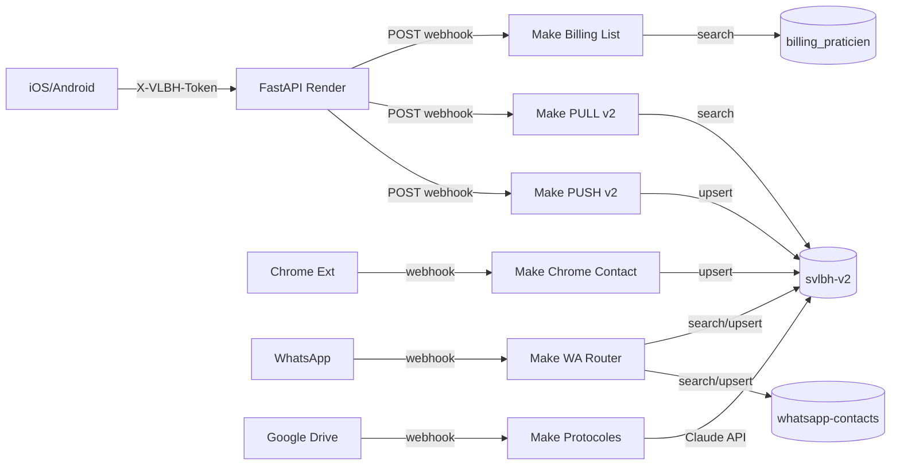
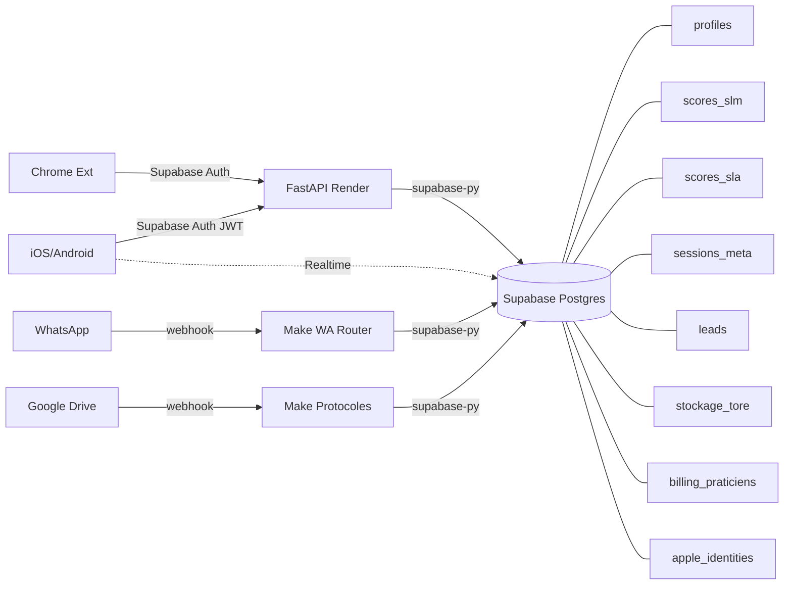

# Make.com → Supabase Migration Spec

> Generated 2026-04-21 — Cutover net, 7 shamanes a notifier
> Source: Make.com EU2, org 1799074, team 630342

## 1. Datastores actifs — Inventaire

| # | Datastore Make | ID | Records | Size | Structure ID | Scenarios |
|---|---|---|---|---|---|---|
| 1 | `svlbh-v2` | 155674 | 202 | 72 KB | 558099 | **15** (PUSH/PULL v2, WhatsApp, Segment, Chrome, Evernote, Build Gate, Session History, Protocoles, Shamanes Pending, Sync Praticien, List, TikTok, hDOM PULL v2) |
| 2 | `billing_praticien` | 156396 | 21 | 7.4 KB | 560119 | 3 (TikTok, Billing List, Sync Praticien) |
| 3 | `svlbh-whatsapp-contacts` | 157329 | 52 | 12.6 KB | 563484 | 2 (WhatsApp ROUTER, DM-v03-P3 dup) |
| 4 | `svlbh-watchdog-incidents` | 159134 | 433 | 75 KB | 569263 | 1 (Watchdog Infra) |
| 5 | `svlbh-ref-21s` | 157532 | 21 | 2.1 KB | 564088 | 1 (Passeport Ratio 4D) |
| 6 | `svlbh-apple-identity` | 156475 | 6 | 705 B | 560370 | 1 (Apple Identity) |
| 7 | `svlbh_active_leads` | 155678 | 1 | 111 B | 558908 | 3 (Presence REGISTER/DISCONNECT/Check) |
| 8 | `svlbh-hdom-sessions` | 155208 | 1 | 54 B | 556791 | 1 (hDOM PULL Response) |
| 9 | `svlbh-services` | 157490 | 3 | 1 KB | 563938 | **0 (orphelin)** |
| 10 | `svlbh-transactions` | 157491 | 2 | 889 B | 563939 | **0 (orphelin)** |

### Constat critique

`svlbh-v2` est un **god-datastore** : 202 records, 15 scenarios, melange de SLM/SLA/SESSION/LEAD/TORE/profils/segments/hDOM.
Le champ `payload` (type text) stocke du JSON serialise — pas de schema enforce.

### Orphelins a arbitrer

- `svlbh-services` (catalogue tarifaire) et `svlbh-transactions` (paiements Twint) : 0 scenarios lies. Probablement lus manuellement via l'UI Make. **Decision PO** : migrer vers Supabase ou abandonner ?

---

## 2. Mapping Datastore → Tables Supabase

### 2.1 Decomposition de `svlbh-v2` (god-datastore → 7 tables)

Le datastore `svlbh-v2` stocke tout dans un seul record par `sessionKey` avec un champ `payload` JSON. Le backend FastAPI distingue les modules via le champ `module` (SLM, SLA, SESSION, LEAD, TORE). Supabase permet de normaliser en tables distinctes.

```
svlbh-v2 (1 datastore)
  ├── profiles         (prenom, nom, email, telephone, segment, oidc_*)
  ├── sessions_hdom    (sessionKey → payload JSON, module routing)
  ├── scores_slm       (SLA_T, SLSA_T, SLM_T, SLA_P, SLSA_P, SLM_P...)
  ├── scores_sla       (SLA_T, SLA_P per session)
  ├── sessions_meta    (patientId, sessionNum, programCode, status...)
  ├── leads            (shamaneCode, prenom, nom, tier, status...)
  └── stockage_tore    (tore/glycemie/sclerose/couplage fields)
```

### 2.2 Tables directes (1:1 avec datastores existants)

```
billing_praticien     → billing_praticiens
svlbh-whatsapp-contacts → whatsapp_contacts
svlbh-watchdog-incidents → watchdog_incidents
svlbh-ref-21s         → ref_21s
svlbh-apple-identity  → apple_identities
svlbh_active_leads    → active_leads
svlbh-hdom-sessions   → hdom_sessions
svlbh-services        → services_catalog
svlbh-transactions    → transactions
```

---

## 3. DDL Postgres (draft migration)

### 3.1 Cle de jointure universelle : `mobile_hash`

`mobile_hash` (SHA256 tronque) est la cle anonyme reliant `billing_praticien`, `apple_identities`, `whatsapp_contacts` et `transactions`. En Supabase, cela devient un index + FK potentiel.

### 3.2 Tables

```sql
-- ============================================================
-- profiles (ex svlbh-v2 champs identite)
-- ============================================================
CREATE TABLE profiles (
    id UUID DEFAULT gen_random_uuid() PRIMARY KEY,
    mobile_hash TEXT UNIQUE,
    prenom TEXT,
    nom TEXT,
    email TEXT,
    telephone TEXT,
    segment TEXT CHECK (segment IN (
        'lead','patient_actif','prospect','praticien','alumni','certifiee'
    )),
    auto_reply BOOLEAN DEFAULT false,
    oidc_sub TEXT,
    oidc_full_name TEXT,
    oidc_provider TEXT,
    nb_consultantes INTEGER,
    cap_max INTEGER,
    score_hdom_groupe INTEGER,
    score_hdom_shamanes INTEGER,
    seuil_deharmonie INTEGER,
    statut TEXT,
    alerte_deharmonie BOOLEAN DEFAULT false,
    derniere_verification TIMESTAMPTZ,
    created_at TIMESTAMPTZ DEFAULT now(),
    updated_at TIMESTAMPTZ DEFAULT now(),
    updated_by TEXT
);

-- ============================================================
-- scores_slm (ex svlbh-v2 module SLM)
-- ============================================================
CREATE TABLE scores_slm (
    id UUID DEFAULT gen_random_uuid() PRIMARY KEY,
    session_key TEXT NOT NULL,
    therapist_name TEXT,
    platform TEXT DEFAULT 'ios',
    -- Therapist scores
    sla_t INTEGER,
    slsa_t INTEGER,
    slsa_s1_t INTEGER,
    slsa_s2_t INTEGER,
    slsa_s3_t INTEGER,
    slsa_s4_t INTEGER,
    slsa_s5_t INTEGER,
    slm_t INTEGER,
    tot_slm_t INTEGER,
    -- Patrick scores
    sla_p INTEGER,
    slsa_p INTEGER,
    slsa_s1_p INTEGER,
    slsa_s2_p INTEGER,
    slsa_s3_p INTEGER,
    slsa_s4_p INTEGER,
    slsa_s5_p INTEGER,
    slm_p INTEGER,
    tot_slm_p INTEGER,
    created_at TIMESTAMPTZ DEFAULT now()
);
CREATE INDEX idx_scores_slm_session ON scores_slm(session_key);

-- ============================================================
-- scores_sla (ex svlbh-v2 module SLA)
-- ============================================================
CREATE TABLE scores_sla (
    id UUID DEFAULT gen_random_uuid() PRIMARY KEY,
    session_key TEXT NOT NULL,
    therapist_name TEXT,
    platform TEXT DEFAULT 'ios',
    sla_therapist INTEGER,
    sla_patrick INTEGER,
    created_at TIMESTAMPTZ DEFAULT now()
);
CREATE INDEX idx_scores_sla_session ON scores_sla(session_key);

-- ============================================================
-- sessions_meta (ex svlbh-v2 module SESSION)
-- ============================================================
CREATE TABLE sessions_meta (
    id UUID DEFAULT gen_random_uuid() PRIMARY KEY,
    session_key TEXT NOT NULL UNIQUE,
    patient_id TEXT,
    session_num INTEGER,
    program_code TEXT,
    practitioner_code TEXT,
    therapist_name TEXT,
    status TEXT,
    event_count INTEGER,
    liberated_count INTEGER,
    platform TEXT DEFAULT 'ios',
    created_at TIMESTAMPTZ DEFAULT now()
);

-- ============================================================
-- leads (ex svlbh-v2 module LEAD)
-- ============================================================
CREATE TABLE leads (
    id UUID DEFAULT gen_random_uuid() PRIMARY KEY,
    shamane_code TEXT NOT NULL,
    session_key TEXT,
    prenom TEXT,
    nom TEXT,
    tier TEXT,
    status TEXT,
    platform TEXT DEFAULT 'ios',
    created_at TIMESTAMPTZ DEFAULT now()
);
CREATE INDEX idx_leads_shamane ON leads(shamane_code);

-- ============================================================
-- stockage_tore (ex svlbh-v2 module TORE)
-- ============================================================
CREATE TABLE stockage_tore (
    id UUID DEFAULT gen_random_uuid() PRIMARY KEY,
    session_key TEXT NOT NULL,
    therapist_name TEXT,
    platform TEXT DEFAULT 'ios',
    -- Champ toroidal
    tore_intensite INTEGER,
    tore_coherence INTEGER,
    tore_frequence NUMERIC(10,2),
    tore_phase TEXT CHECK (tore_phase IN ('repos','charge','decharge','transition')),
    -- Glycemie
    glyc_index INTEGER,
    glyc_balance INTEGER,
    glyc_absorption INTEGER,
    glyc_resistance INTEGER,
    -- Sclerose
    scl_score INTEGER,
    scl_densite INTEGER,
    scl_elasticite INTEGER,
    scl_permeabilite INTEGER,
    -- Couplage
    corr_tg INTEGER,
    corr_ts INTEGER,
    corr_gs INTEGER,
    score_couplage INTEGER,  -- auto-calc
    flux_net INTEGER,
    phase_couplage TEXT CHECK (phase_couplage IN ('synergie','compensation','decouplage','collapse')),
    -- Sclerose tissulaire
    st_fibrose INTEGER,
    st_zones INTEGER,
    st_profondeur INTEGER,
    st_revascularisation INTEGER,
    st_decompaction INTEGER,
    -- Stockage global
    niveau INTEGER,
    capacite INTEGER,
    taux_restauration INTEGER,
    rendement NUMERIC(5,2),  -- auto-calc: niveau/capacite * 100
    created_at TIMESTAMPTZ DEFAULT now()
);
CREATE INDEX idx_stockage_tore_session ON stockage_tore(session_key);

-- ============================================================
-- hdom_sessions (ex svlbh-hdom-sessions, 1 record legacy)
-- ============================================================
CREATE TABLE hdom_sessions (
    id UUID DEFAULT gen_random_uuid() PRIMARY KEY,
    session_key TEXT NOT NULL UNIQUE,
    content JSONB,
    created_at TIMESTAMPTZ DEFAULT now(),
    updated_at TIMESTAMPTZ DEFAULT now()
);

-- ============================================================
-- billing_praticiens (ex billing_praticien #156396)
-- ============================================================
CREATE TABLE billing_praticiens (
    id UUID DEFAULT gen_random_uuid() PRIMARY KEY,
    code TEXT UNIQUE NOT NULL,  -- PK dans Make = key du record
    mobile_hash TEXT,
    nom_praticien TEXT,
    role TEXT,
    statut TEXT CHECK (statut IN ('active','passive')),
    statut_conscience_duale TEXT,
    score_emotionnel INTEGER,
    compteur_max_patient INTEGER,
    compteur INTEGER DEFAULT 0,
    formation_max TEXT,
    periode_active_start TEXT,
    periode_active_end TEXT,
    code_tier TEXT,
    lien_push TEXT,
    quota_libre INTEGER DEFAULT 0,
    quota_libre_pct INTEGER DEFAULT 0,
    created_at TIMESTAMPTZ DEFAULT now(),
    updated_at TIMESTAMPTZ DEFAULT now(),
    updated_by TEXT
);
CREATE INDEX idx_billing_mobile_hash ON billing_praticiens(mobile_hash);

-- ============================================================
-- apple_identities (ex svlbh-apple-identity #156475)
-- ============================================================
CREATE TABLE apple_identities (
    id UUID DEFAULT gen_random_uuid() PRIMARY KEY,
    code TEXT UNIQUE NOT NULL,
    name TEXT NOT NULL,
    provider TEXT,
    email TEXT,
    mobile_hash TEXT,
    created_at TIMESTAMPTZ DEFAULT now(),
    updated_at TIMESTAMPTZ DEFAULT now()
);
CREATE INDEX idx_apple_id_mobile_hash ON apple_identities(mobile_hash);

-- ============================================================
-- whatsapp_contacts (ex svlbh-whatsapp-contacts #157329)
-- ============================================================
CREATE TABLE whatsapp_contacts (
    id UUID DEFAULT gen_random_uuid() PRIMARY KEY,
    jid TEXT UNIQUE,
    lid TEXT,
    phone TEXT,
    name TEXT,
    bridge TEXT,
    mobile_hash TEXT,
    created_at TIMESTAMPTZ DEFAULT now(),
    updated_at TIMESTAMPTZ DEFAULT now()
);
CREATE INDEX idx_wa_mobile_hash ON whatsapp_contacts(mobile_hash);

-- ============================================================
-- active_leads (ex svlbh_active_leads #155678)
-- ============================================================
CREATE TABLE active_leads (
    id UUID DEFAULT gen_random_uuid() PRIMARY KEY,
    lead_id TEXT NOT NULL,
    connected_at TIMESTAMPTZ NOT NULL,
    tier TEXT,
    pays_origine TEXT,
    date_trauma TEXT,
    slsa_historique INTEGER,
    slsa_ch_21 INTEGER,
    sltda_origine INTEGER,
    sltda_ch INTEGER,
    ratio_4d INTEGER,
    cluster TEXT,
    last_passeport_at TIMESTAMPTZ
);

-- ============================================================
-- ref_21s (ex svlbh-ref-21s #157532 — donnees de reference)
-- ============================================================
CREATE TABLE ref_21s (
    id UUID DEFAULT gen_random_uuid() PRIMARY KEY,
    pays TEXT UNIQUE NOT NULL,
    slta_origine INTEGER,
    sltda_ch INTEGER,
    slsa_ch INTEGER
);

-- ============================================================
-- services_catalog (ex svlbh-services #157490 — orphelin)
-- ============================================================
CREATE TABLE services_catalog (
    id UUID DEFAULT gen_random_uuid() PRIMARY KEY,
    code TEXT UNIQUE NOT NULL,
    nom_service TEXT,
    montant NUMERIC(10,2),
    devise TEXT CHECK (devise IN ('CHF','EUR')),
    type_facturation TEXT,
    recurrence BOOLEAN DEFAULT false,
    duree_jours INTEGER,
    auto_reply BOOLEAN DEFAULT false,
    routine_matin BOOLEAN DEFAULT false,
    groupe_whatsapp TEXT,
    session_hdom BOOLEAN DEFAULT false,
    planche_tactique BOOLEAN DEFAULT false,
    protocole_complet BOOLEAN DEFAULT false,
    statut TEXT DEFAULT 'actif',
    created_at TIMESTAMPTZ DEFAULT now(),
    updated_at TIMESTAMPTZ DEFAULT now()
);

-- ============================================================
-- transactions (ex svlbh-transactions #157491 — orphelin)
-- ============================================================
CREATE TABLE transactions (
    id UUID DEFAULT gen_random_uuid() PRIMARY KEY,
    mobile_hash TEXT,
    service_code TEXT REFERENCES services_catalog(code),
    montant NUMERIC(10,2),
    devise TEXT CHECK (devise IN ('CHF','EUR')),
    payeur_nom TEXT,
    source TEXT CHECK (source IN ('twint_sms','twint_manual','virement')),
    activated_at TIMESTAMPTZ,
    expires_at TIMESTAMPTZ,
    booking_status TEXT CHECK (booking_status IN ('pending','booked','expired')),
    created_at TIMESTAMPTZ DEFAULT now(),
    updated_at TIMESTAMPTZ DEFAULT now(),
    updated_by TEXT
);
CREATE INDEX idx_tx_mobile_hash ON transactions(mobile_hash);

-- ============================================================
-- watchdog_incidents (ex svlbh-watchdog-incidents)
-- ============================================================
CREATE TABLE watchdog_incidents (
    id UUID DEFAULT gen_random_uuid() PRIMARY KEY,
    timestamp TIMESTAMPTZ NOT NULL,
    module TEXT NOT NULL,
    error_name TEXT NOT NULL,
    error_message TEXT,
    scenarios_count INTEGER,
    queue_total INTEGER
);
CREATE INDEX idx_watchdog_ts ON watchdog_incidents(timestamp DESC);
```

---

## 4. Modele d'authentification

### Actuel (Make + FastAPI)

```
Client iOS/Android
  → Header X-VLBH-Token (token unique partage)
  → FastAPI (verify_token)
  → POST Make.com webhook (pas d'auth cote Make, ou x-make-apikey)
```

Un seul token pour tous les praticiens. Pas de distinction utilisateur.

### Cible Supabase

```
Client iOS/Android
  → Supabase Auth (Apple Sign-In / Google OIDC)
  → JWT avec claims { sub, role, mobile_hash }
  → RLS policies par table
```

Mapping :
- `apple_identities.oidc_sub` → `auth.uid()` dans Supabase
- `profiles.mobile_hash` → claim custom dans le JWT (pour joindre billing/whatsapp)
- Roles : `praticien` (certifiee/superviseur), `patient`, `service` (backend)

### RLS Policies (draft)

```sql
-- Les praticiens ne voient que leurs propres scores
ALTER TABLE scores_slm ENABLE ROW LEVEL SECURITY;
CREATE POLICY "praticien_own_scores" ON scores_slm
    FOR ALL USING (
        session_key IN (
            SELECT session_key FROM sessions_meta
            WHERE practitioner_code = auth.jwt()->>'mobile_hash'
        )
    );

-- billing_praticiens: read pour tous les praticiens, write pour service only
ALTER TABLE billing_praticiens ENABLE ROW LEVEL SECURITY;
CREATE POLICY "praticien_read_billing" ON billing_praticiens
    FOR SELECT USING (auth.jwt()->>'role' IN ('praticien','service'));
CREATE POLICY "service_write_billing" ON billing_praticiens
    FOR ALL USING (auth.jwt()->>'role' = 'service');

-- ref_21s: lecture seule pour tous (donnees de reference)
ALTER TABLE ref_21s ENABLE ROW LEVEL SECURITY;
CREATE POLICY "public_read_ref" ON ref_21s
    FOR SELECT USING (true);

-- watchdog_incidents: service only
ALTER TABLE watchdog_incidents ENABLE ROW LEVEL SECURITY;
CREATE POLICY "service_only_watchdog" ON watchdog_incidents
    FOR ALL USING (auth.jwt()->>'role' = 'service');
```

> **Note PO** : les policies exactes dependent du modele de permissions final. Le draft ci-dessus est un point de depart.

---

## 5. Logique metier — Destination cible

### Calculs auto-serveur

| Logique | Actuellement | Destination Supabase | Justification |
|---|---|---|---|
| `SLSA = sum(S1..S5) / 5` | Make scenario (PUSH v2) | **Postgres trigger** `BEFORE INSERT` sur `scores_slm` | Calcul deterministe, pas de deps externes |
| `rendement = niveau / capacite * 100` | Make scenario (PUSH v2) | **Postgres trigger** `BEFORE INSERT` sur `stockage_tore` | Idem |
| `scoreCouplage` (auto-calc) | Make scenario | **Postgres trigger** sur `stockage_tore` | Formule basee sur corr_tg/ts/gs |
| `phaseCouplage` (auto-infer) | Make scenario | **Postgres trigger** sur `stockage_tore` | Classification basee sur seuils |
| Timestamps `created_at/updated_at` | Make scenario | **Postgres DEFAULT** + trigger `updated_at` | Standard Supabase |
| `last_updated_by` | Make scenario | **App-level** (passe par le backend) | Pas inferable cote DB |

### Routage / orchestration

| Logique | Actuellement | Destination | Justification |
|---|---|---|---|
| WhatsApp ROUTER (message in → contact lookup → route → auto-reply) | Make scenario 8944541 | **Supabase Edge Function** + **n8n ou Keep Make** | Complexe, depend d'API WhatsApp externe |
| Segment UPDATE (changer segment d'un profil) | Make scenario 8944575 | **Backend FastAPI** (simple UPDATE) | Trivial en SQL |
| Nouveau Contact Chrome (extension → create profile) | Make scenario 8949007 | **Backend FastAPI** (INSERT profile) | Trivial |
| Sync Praticien (billing ↔ svlbh-v2) | Make scenario 8953234 | **Postgres trigger** cross-table | Sync entre `billing_praticiens` et `profiles` |
| Session History (list sessions) | Make scenario 8956176 | **Supabase query** directe (SELECT) | Plus besoin de scenario |
| Build Gate (version gating) | Make scenario 8958284 | **Supabase table** + query directe | Simple read |
| Evernote → DataStore Bulk Transfer | Make scenario 8952485 | **Garder sur Make** (transitoire) | Depend d'API Evernote |
| Protocoles GDrive → Claude → svlbh-v2 | Make scenario 9019813 | **Garder sur Make** ou migrer vers Edge Function + Claude API | Depend d'API GDrive + Anthropic |
| Passeport Ratio 4D | Make scenario 8999937 | **Edge Function** | Lookup `ref_21s` + calcul |
| Watchdog Infra | Make scenario 9017210 | **Supabase cron** (pg_cron) ou garder Make | Monitoring |
| Billing List | Make scenario 8997028 | **Backend FastAPI** (SELECT billing_praticiens) | Remplace webhook |
| TikTok Endo-Suisse → Twint | Make scenario 8577181 | **Garder sur Make** | Integration TikTok + Twint specifique |
| Presence REGISTER/DISCONNECT/Check | Make scenarios 8932319/21/8983873 | **Backend FastAPI** + Supabase Realtime | Presence = Supabase Realtime natif |

### Resume des destinations

| Destination | Nb de logiques |
|---|---|
| **Postgres triggers** | 5 (calculs deterministes) |
| **Backend FastAPI → Supabase directe** | 5 (CRUD simples) |
| **Supabase Edge Functions** | 2 (Passeport Ratio 4D, WhatsApp optionnel) |
| **Garder sur Make** (transitoire) | 3 (Evernote, TikTok/Twint, GDrive/Claude) |
| **Supabase natif** (Realtime, query) | 3 (Presence, Session History, Build Gate) |

---

## 6. Webhooks — Nettoyage

### Hooks orphelins (aucun scenario lie)

| Hook | Nom | Action |
|---|---|---|
| 3981639 | `svlbh-push` (v1) | **Supprimer** |
| 3981640 | `svlbh-pull` (v1) | **Supprimer** |
| 3982131 | `svlbh-pull-v2` (doublon) | **Supprimer** |
| 3982135 | `svlbh-push-cornelia` | **Supprimer** |
| 3982136 | `svlbh-pull-patrick` | **Supprimer** |
| 3982147 | `svlbh-push-patrick-v2` | **Supprimer** |
| 4022599 | `ma-v1-trigger` | **Supprimer** |
| 4001492 | `SVLBH Apple Sign-In SYNC` | **Supprimer** |
| 3830455 | `PDF Conversion Trigger` (web) | **Supprimer** |
| 3830376 | `PDF Conversion Trigger` (mail) | **Supprimer** |
| 3836714 | `My gateway-webhook` (unnamed) | **Supprimer** |
| 4003428 | `VLBH Evernote Search` | **Supprimer** |

### Scenarios inactifs

| Scenario | Nom | Action |
|---|---|---|
| 8574373 | 1ere Discussion | **Supprimer** (inactif) |
| 8577202 | Discussion sms | **Supprimer** (inactif) |
| 8577984 | Integration Webhooks, HTTP, Slack | **Supprimer** (inactif) |
| 8590988 | SVLBH WhatsApp Production | **Supprimer** (remplace par ROUTER) |
| 8591603 | Integration Webhooks | **Supprimer** (inactif) |
| 8730432 | Integration Webhooks, HTTP | **Supprimer** (inactif) |
| 9085048 | DM-v03-P3 WhatsApp ROUTER (DUP) | **Supprimer** (doublon de 8944541) |
| 8687584 | Claude → Slack | **Supprimer** (inactif) |
| 9000036 | SVLBH Shamanes Pending | **Verifier** (inactif mais reference svlbh-v2) |
| 9048144 | SVLBH Asana RTM-Bot | **Supprimer** (inactif, 51 queued) |

---

## 7. Backend FastAPI — Changements requis

### Avant (Make.com)

```
FastAPI → POST Make webhook → Make scenario → DataStore svlbh-v2
```

### Apres (Supabase)

```
FastAPI → supabase-py client → Postgres (tables normalisees)
```

### Modifications par router

| Router | Endpoint | Changement |
|---|---|---|
| `slm.py` | POST /slm/push | `make.push_slm()` → `supabase.table('scores_slm').insert()` |
| `slm.py` | POST /slm/pull | `make.pull_slm()` → `supabase.table('scores_slm').select().eq('session_key', key)` |
| `sla.py` | POST /sla/push | Idem → `scores_sla` |
| `sla.py` | POST /sla/pull | Idem |
| `session.py` | POST /session/push | → `sessions_meta` upsert |
| `session.py` | POST /session/pull | → `sessions_meta` select |
| `lead.py` | POST /lead/push | → `leads` insert |
| `lead.py` | POST /lead/pull | → `leads` select |
| `tore.py` | POST /tore/push | → `stockage_tore` insert (triggers calculent rendement/scoreCouplage) |
| `tore.py` | POST /tore/pull | → `stockage_tore` select |
| `billing.py` | GET /billing/list | → `billing_praticiens` select (plus de webhook Make) |
| `main.py` | lifespan | Remplacer `MakeService` par client `supabase-py` |
| `services/make_service.py` | tout | **Supprimer** — remplace par `services/supabase_service.py` |
| `dependencies.py` | `get_make_service` | → `get_supabase_client` |

### Nouvelles deps Python

```
# requirements.txt
supabase>=2.0.0
# supprimer: (httpx reste pour health checks eventuels)
```

---

## 8. Plan de cutover

### Pre-requis (J-7)

- [ ] DDL execute sur Supabase (section 3)
- [ ] Triggers crees (rendement, SLSA, scoreCouplage, updated_at)
- [ ] RLS policies activees (section 4)
- [ ] `services/supabase_service.py` ecrit et teste
- [ ] Routers migres (section 7)
- [ ] Tests E2E passes (push/pull chaque module)
- [ ] Dump des datastores Make → SQL INSERT pour donnees existantes
- [ ] CI/CD Render pointe sur la branche avec Supabase

### Comm shamanes (J-3)

Message WhatsApp aux 7 shamanes :

> **[VLBH] Maintenance planifiee**
> Bonjour, l'app SVLBH Panel sera indisponible le [DATE] de [HEURE] a [HEURE] (environ 2h).
> Nous migrons l'infrastructure vers un systeme plus rapide et fiable.
> Aucune action requise de votre part. Vos donnees seront preservees.
> Merci de ne pas lancer de session pendant cette fenetre.
> — Patrick

### Jour J (cutover ~2h)

| Etape | Duree | Action |
|---|---|---|
| 1 | 5 min | Desactiver les 15 scenarios actifs sur Make |
| 2 | 15 min | Dump final datastores Make → SQL INSERT → Supabase |
| 3 | 5 min | Verifier counts: `SELECT count(*) FROM <table>` vs Make records |
| 4 | 5 min | Deploy backend Supabase sur Render (merge branche) |
| 5 | 10 min | Smoke test: push/pull chaque module depuis curl |
| 6 | 10 min | Test app iOS/Android (1 session complete) |
| 7 | 5 min | Message WhatsApp "c'est bon, vous pouvez utiliser l'app" |
| 8 | 30 min | Monitoring (Supabase dashboard + logs Render) |

### Rollback (si probleme)

- Reactiver les scenarios Make (5 min)
- Revert deploy Render vers le commit precedent (5 min)
- Les donnees Make sont intactes (pas de suppression avant J+30)

### Post-cutover (J+30)

- [ ] Supprimer les 12 webhooks orphelins (section 6)
- [ ] Supprimer les 10 scenarios inactifs (section 6)
- [ ] Supprimer les datastores Make (apres backup final)
- [ ] Downgrade plan Make.com si plus utilise

---

## 9. Diagramme de dependances (avant/apres)

### Avant



### Apres



---

## 10. Structures Make non liees a un datastore (info)

Ces data structures existent sur Make mais ne sont liees a aucun datastore actif. A archiver :

| Structure | ID | Usage |
|---|---|---|
| Anthropic Messages API Body | 561143 | Schema pour appels Claude dans scenarios |
| Facture | 536040 | Ancien prototype factures |
| Sensibilisation - Discrimination | 531963 | Ancien prototype |
| svlbh-build-gate | 561009 | Inline dans scenario Build Gate |
| svlbh-build-vlbh-therapy | 566452 | Inline dans scenario build |
| svlbh_config_struct | 558909 | Config max_active_leads (inline) |
| svlbh-payload | 556846 | Generic payload wrapper |
| svlbh-recherche-structure | 558107 | Ancien prototype recherche |
| svlbh-vault | 563669 | Transcriptions vocales (pas de datastore) |
| VLBH Evernote Search | 560371 | Evernote search results |
